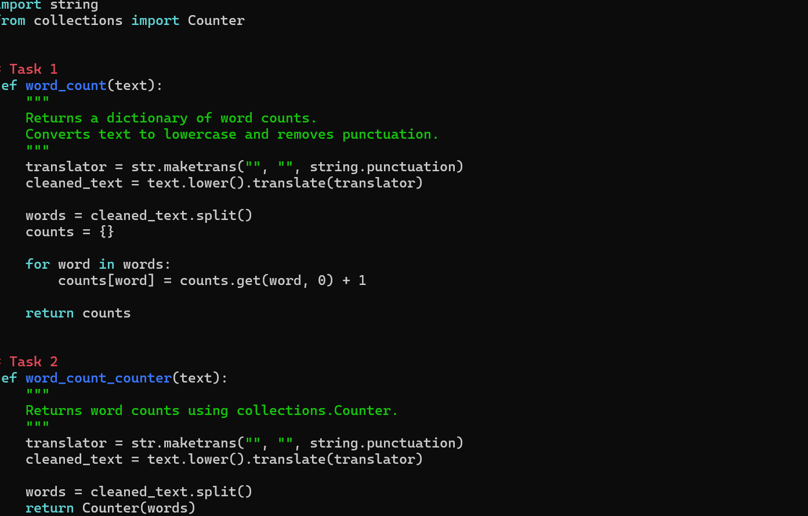
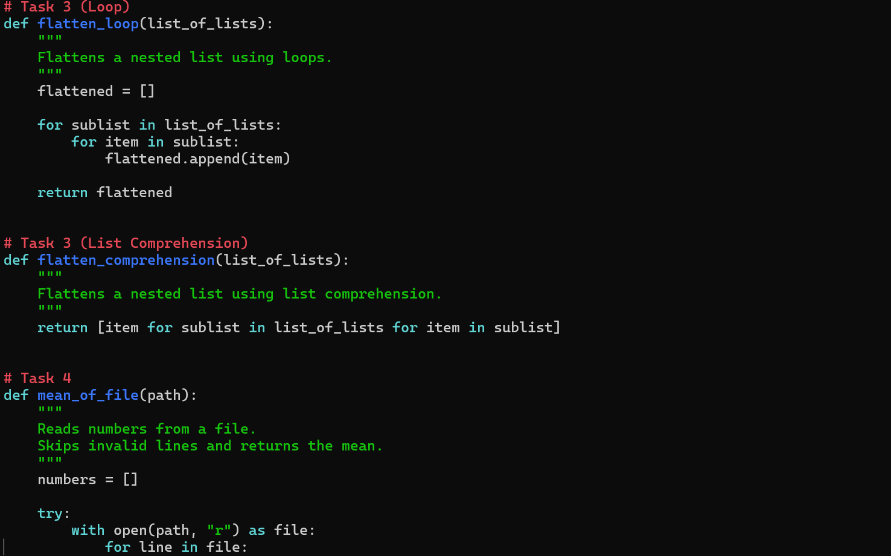
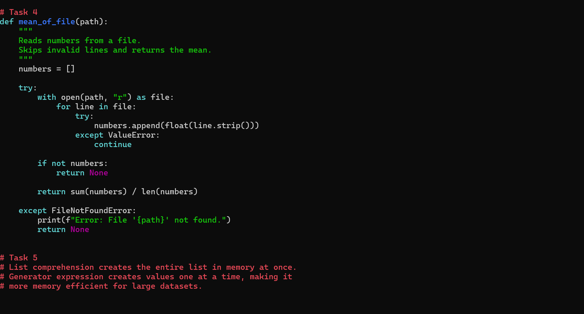
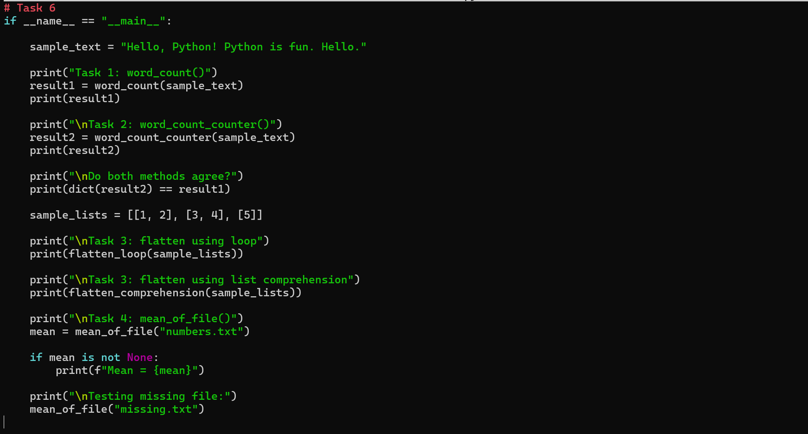
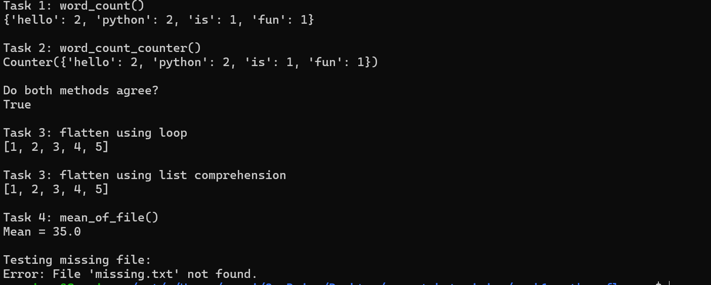

# Week 1 - Python Fluency (Lab 2)

## Overview

This lab focuses on improving Python programming skills by implementing common programming problems using Python's built-in features and standard library.

The lab demonstrates the use of:

- Dictionaries
- collections.Counter
- List Comprehensions
- File Handling
- Exception Handling
- Modular Programming
- Python Functions

---

# Tasks Completed

## Task 1 - Word Count using Dictionary

Implemented a function that counts the frequency of each word in a sentence.

The function:

- Converts all text to lowercase
- Removes punctuation
- Splits the text into individual words
- Stores the frequency of each word inside a dictionary

Example Output

```python
{'hello': 2, 'python': 2, 'is': 1, 'fun': 1}
```

---

## Task 2 - Word Count using collections.Counter

Implemented the same word counting problem using Python's built-in `collections.Counter`.

Compared the output of both implementations to verify they produce identical results.

---

## Task 3 - Flatten a Nested List

Implemented two different approaches to flatten a nested list.

### Using Nested Loops

Input

```python
[[1, 2], [3, 4], [5]]
```

Output

```python
[1, 2, 3, 4, 5]
```

### Using List Comprehension

Implemented the same functionality using Python's list comprehension syntax to produce a cleaner and more concise solution.

---

## Task 4 - Mean of Numbers from a File

Created a function that:

- Reads numbers from a text file
- Ignores invalid entries using exception handling
- Calculates the arithmetic mean
- Gracefully handles missing files without crashing the program

Example File

```
10
20
30
40
50
invalid
60
```

Output

```
35.0
```

---

## Task 5 - List Comprehension vs Generator Expression

Studied the difference between List Comprehensions and Generator Expressions.

### List Comprehension

- Creates the complete list immediately
- Uses more memory
- Best when all values are required

### Generator Expression

- Generates values one at a time
- Uses significantly less memory
- Better suited for very large datasets

---

## Task 6 - Program Execution

Used

```python
if __name__ == "__main__":
```

to execute and test every implemented function from a single entry point.

---

# Project Structure

```
week1-python-fluency/
│── main.py
│── numbers.txt
│── README.md
│── requirements.txt
│── .gitignore
└── screenshots/
    ├── code1.png
    ├── code2.png
    ├── code3.png
    └── output.png
```

---

# Learning Outcomes

Through this lab I learned:

- Creating reusable functions using `def`
- Working with Python dictionaries
- Using `collections.Counter`
- String manipulation
- Removing punctuation from text
- Working with nested lists
- List comprehensions
- Generator expressions
- Reading files using `with open()`
- Exception handling using `try` and `except`
- Calculating averages from file data
- Writing modular and readable Python code

---

# Challenges Faced

While completing this lab, I encountered several concepts that required additional understanding:

- Understanding how `str.maketrans()` and `translate()` work together to remove punctuation.
- Learning the difference between manually counting words using dictionaries and using `collections.Counter`.
- Understanding nested loops while flattening nested lists.
- Learning the syntax of list comprehensions.
- Understanding why generator expressions are more memory efficient than list comprehensions.
- Reading data from files safely using `with open()`.
- Handling invalid data using exception handling.
- Understanding the purpose of `if __name__ == "__main__":`.

Overcoming these challenges helped strengthen my understanding of Python fundamentals.

---

# How to Run

## Clone the Repository

```bash
git clone <repository-url>
```

## Navigate to the Project Folder

```bash
cd week1-python-fluency
```

## Run the Program

```bash
python3 main.py
```

---

# Sample Output

```
Task 1: word_count()
{'hello': 2, 'python': 2, 'is': 1, 'fun': 1}

Task 2: word_count_counter()
Counter({'hello': 2, 'python': 2, 'is': 1, 'fun': 1})

Do both methods agree?
True

Task 3: flatten using loop
[1, 2, 3, 4, 5]

Task 3: flatten using list comprehension
[1, 2, 3, 4, 5]

Task 4: mean_of_file()
Mean = 35.0

Testing missing file:
Error: File 'missing.txt' not found.
```

---
# Screenshots

## Code - Part 1



---

## Code - Part 2



---

## Code - Part 3



---

## Code - Part 4



---

## Program Output



---

# Technologies Used

- Python 3
- collections.Counter
- Built-in string module
- Git
- GitHub
- Ubuntu (WSL)

---

# Author

**Gursimar**

Week 1 Python Fluency Lab 2
