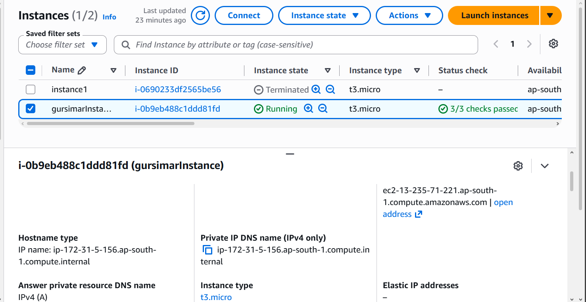
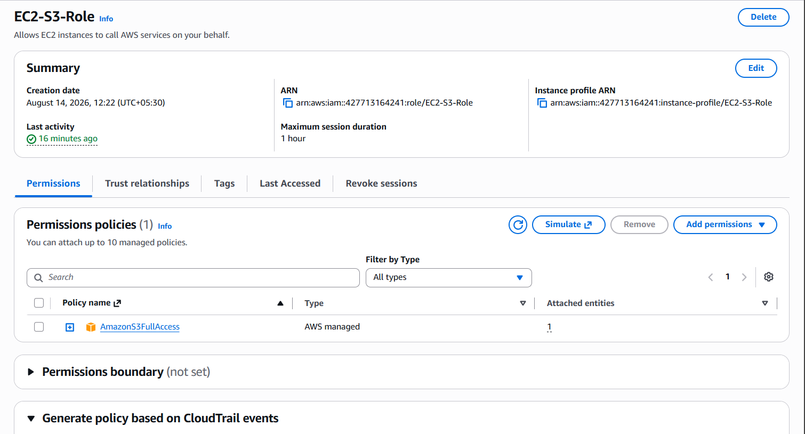
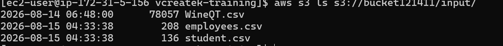
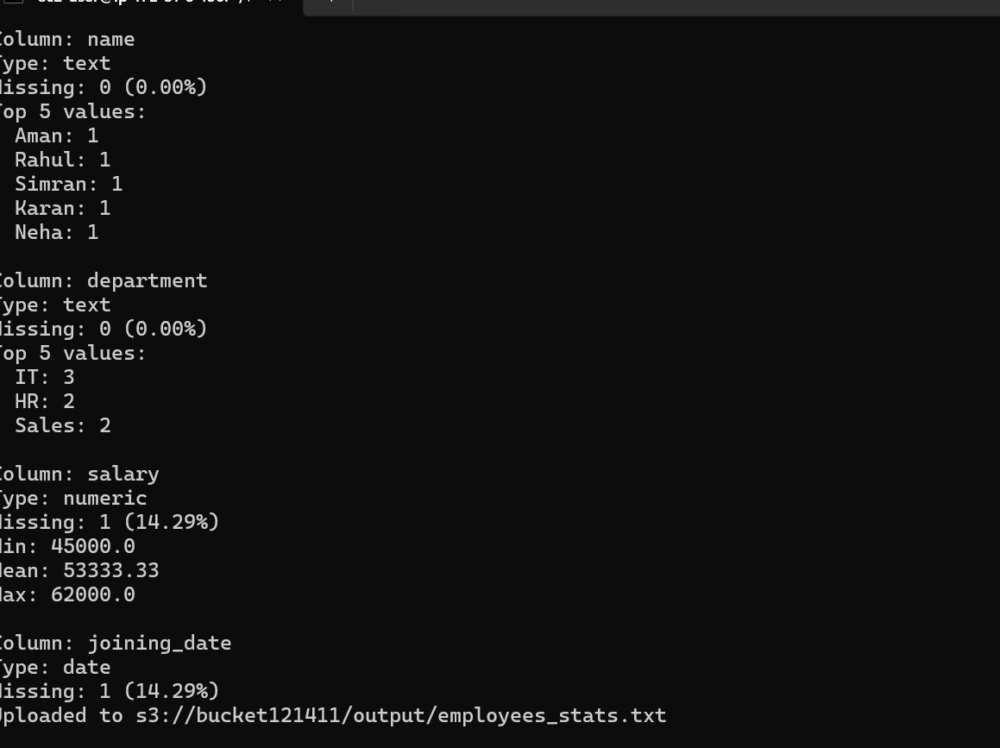
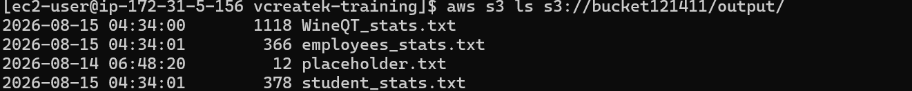

# Week 2 – AWS EC2 + S3 CSV Processing Pipeline

## Overview

This project demonstrates how to build a cloud-based data processing pipeline using **Amazon EC2**, **Amazon S3**, **IAM Roles**, **AWS CLI**, and **Python**.

The existing `csvstat.py` script was modified so that it reads CSV files directly from an **S3 `input/` folder**, processes them on an **EC2 instance**, and uploads the generated profiling reports back to the **S3 `output/` folder**.

This simulates a practical cloud workflow used in real-world data engineering.

---

## Assignment Objective

* Launch an Amazon EC2 instance.
* Connect through SSH using a `.pem` key.
* Create an S3 bucket with `input/` and `output/` folders.
* Upload CSV files into S3.
* Modify `csvstat.py` to read directly from S3.
* Save generated reports back into S3.
* Authenticate using an IAM Instance Profile instead of Access Keys.
* Document the complete implementation.

---

## Technologies Used

| Technology   | Purpose               |
| ------------ | --------------------- |
| Amazon EC2   | Cloud Virtual Machine |
| Amazon S3    | Cloud Storage         |
| IAM Role     | Secure Authentication |
| AWS CLI      | AWS Management        |
| Python       | Data Processing       |
| Pandas       | CSV Profiling         |
| Boto3        | S3 Integration        |
| Git & GitHub | Version Control       |

---

## Architecture

```text
GitHub Repository
        │
        ▼
Amazon EC2 (IAM Role)
        │
        ├── Read CSV files from S3 input/
        ├── Process using csvstat.py
        └── Upload reports to S3 output/
        ▼
Amazon S3
├── input/
│   ├── WineQT.csv
│   ├── employees.csv
│   └── student.csv
└── output/
    ├── WineQT_stats.txt
    ├── employees_stats.txt
    └── student_stats.txt
```

---

## Step 1 – Launch EC2

Configuration used:

| Setting        | Value             |
| -------------- | ----------------- |
| AMI            | Amazon Linux 2023 |
| Instance Type  | t3.micro          |
| IAM Role       | EC2-S3-Role       |
| Authentication | SSH Key Pair      |

### EC2 Running



---

## Step 2 – Connect via SSH

```bash
ssh -i ~/.ssh/new1.pem ec2-user@13.235.71.221
```

---

## Step 3 – IAM Authentication

Instead of storing AWS credentials on the server, the EC2 instance uses an **IAM Instance Profile**.

Verification:

```bash
aws sts get-caller-identity
```

Example output:

```json
{
  "UserId": "AROAWHFNQ6PIWCVODTGIP:i-0690233df2565be56",
  "Account": "427713164241",
  "Arn": "arn:aws:sts::427713164241:assumed-role/EC2-S3-Role/i-0690233df2565be56"
}
```

### IAM Role Verification



---

## Step 4 – S3 Bucket Setup

Bucket:

```text
bucket121411
```

Structure:

```text
bucket121411/
├── input/
└── output/
```

### Upload CSV Files

```bash
aws s3 cp data/student.csv s3://bucket121411/input/student.csv
aws s3 cp data/employees.csv s3://bucket121411/input/employees.csv
```

### Verify Input

```bash
aws s3 ls s3://bucket121411/input/
```

Example output:

```text
WineQT.csv
employees.csv
student.csv
```

### S3 Input



---

## Step 5 – Updating `csvstat.py`

The original script accepted a local CSV file path.

It was modified to:

* Read CSV files directly from `s3://bucket121411/input/`.
* Automatically process every CSV inside the folder.
* Generate profiling reports.
* Upload reports to `s3://bucket121411/output/`.

The profiling logic remained unchanged.

It still reports:

* Dataset size
* Missing values
* Data types
* Numeric statistics
* Top text values

---

## Step 6 – Running the Pipeline

Install dependencies:

```bash
pip3 install pandas boto3 s3fs
```

Run:

```bash
python3 csvstat.py
```

### Actual Execution Output

The script successfully processed all CSV files stored inside S3.

```text
Processing WineQT.csv...
Rows: 1143
Columns: 13
Uploaded to s3://bucket121411/output/WineQT_stats.txt

Processing employees.csv...
Rows: 7
Columns: 4
Uploaded to s3://bucket121411/output/employees_stats.txt

Processing student.csv...
Rows: 7
Columns: 4
Uploaded to s3://bucket121411/output/student_stats.txt

All CSV files processed successfully.
```

### Script Execution



---

## Step 7 – Verifying Output

Verify the generated reports:

```bash
aws s3 ls s3://bucket121411/output/
```

Example output:

```text
WineQT_stats.txt
employees_stats.txt
student_stats.txt
```

### S3 Output



---

## Project Structure

```text
week2/
└── aws/
    ├── csvstat.py
    ├── README.md
    ├── .gitignore
    ├── data/
    │   ├── student.csv
    │   └── employees.csv
    └── screenshots/
        ├── 01-ec2-running.png
        ├── 02-iam-role.png
        ├── 03-s3-input.png
        ├── 04-csvstat-run.png
        └── 05-s3-output.png
```

---

## Challenges Faced

### SSH Permission Issue

Initially SSH rejected the `.pem` file because its permissions were too open.

Solution:

```bash
chmod 400 ~/.ssh/new1.pem
```

### IAM Authentication

Initially AWS Access Keys were used.

Later they were replaced with an IAM Instance Profile, which is the recommended AWS security practice.

### S3 Path Issues

The script initially searched for CSV files in the wrong location.

Solution:

* Standardized the bucket structure.
* Used `input/` for datasets.
* Used `output/` for generated reports.

---

## Key Commands Used

| Task          | Command                                                          |
| ------------- | ---------------------------------------------------------------- |
| Connect EC2   | `ssh -i ~/.ssh/new1.pem ec2-user@13.235.71.221`                  |
| Verify IAM    | `aws sts get-caller-identity`                                    |
| Upload CSV    | `aws s3 cp data/student.csv s3://bucket121411/input/student.csv` |
| List Input    | `aws s3 ls s3://bucket121411/input/`                             |
| Run Script    | `python3 csvstat.py`                                             |
| Verify Output | `aws s3 ls s3://bucket121411/output/`                            |

---

## Learning Outcomes

This challenge helped me understand:

* Launching and managing EC2 instances.
* Secure authentication using IAM Roles.
* Reading and writing data directly from Amazon S3.
* Integrating Python, Pandas, and Boto3.
* Building an end-to-end cloud data pipeline similar to real production workflows.

The final project demonstrates an EC2 instance securely processing multiple CSV files stored in S3 and automatically saving the generated reports back into the cloud.
