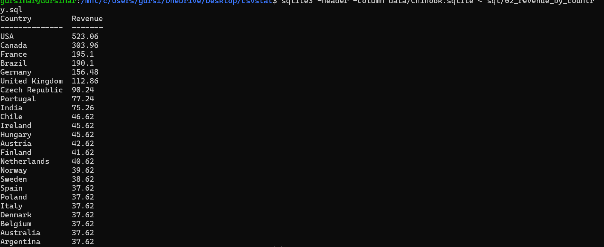
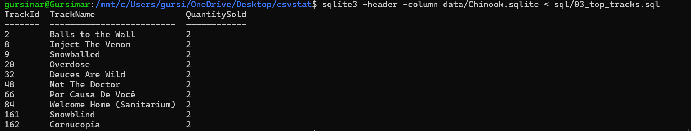
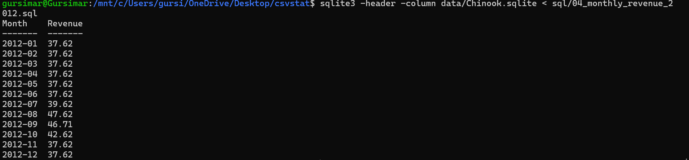

# csvstat

`csvstat` is a command-line Python tool for profiling CSV files. It reads a CSV file and provides a quick summary of its structure, data types, missing values, numeric statistics, and common text values.

# Part A — CSV Data Profiling

## Features

- Accepts a CSV file path from the command line
- Displays the number of rows and columns
- Detects column types as numeric, text, or date
- Counts missing values for each column
- Calculates the percentage of missing values
- Calculates minimum, mean, and maximum for numeric columns
- Displays the most frequent values in text columns
- Supports an optional `--top N` argument
- Uses 5 as the default value for `--top`
- Provides friendly error messages for missing or invalid CSV files

## Technologies Used

- Python 3
- pandas
- argparse
- Git

## Project Structure

```text
csvstat/
├── csvstat.py
├── README.md
├── requirements.txt
├── .gitignore
├── screenshots/
│   ├── outputs (1).png
│   ├── outputs (2).png
│   ├── outputs (3).png
│   ├── outputs (4).png
│   ├── sql_top_customers.png
│   ├── sql_revenue_country.png
│   ├── sql_top_tracks.png
│   └── sql_monthly_revenue.png
├── data/
│   ├── student.csv
│   ├── employees.csv
│   └── Chinook.sqlite
└── sql/
    ├── 01_top_customers.sql
    ├── 02_revenue_by_country.sql
    ├── 03_top_tracks.sql
    └── 04_monthly_revenue_2012.sql
```

## Setup

Create a virtual environment:

```bash
python3 -m venv .venv
```

Activate the virtual environment:

```bash
source .venv/bin/activate
```

Install the required dependencies:

```bash
pip install -r requirements.txt
```

## Usage

Run the tool by providing the path to a CSV file:

```bash
python csvstat.py data/student.csv
```

Another example:

```bash
python csvstat.py data/employees.csv
```

To display the top 3 most frequent values in text columns:

```bash
python csvstat.py data/student.csv --top 3
```

The default value of `--top` is 5.

To display the command-line help:

```bash
python csvstat.py --help
```

## Screenshots

The following screenshots show the tool's output and testing.

### Student CSV Output


### Employee CSV Output


### `--top` Option


### Error Handling / Help


## How the Program Works

The program follows this workflow:

```text
CSV File
   ↓
Command-Line Argument
   ↓
Read CSV using pandas
   ↓
Create DataFrame
   ↓
Count Rows and Columns
   ↓
Detect Column Types
   ↓
Calculate Missing Values
   ↓
Calculate Numeric Statistics
   ↓
Find Frequent Text Values
   ↓
Display Profile
```

### 1. Command-Line Input

The program uses Python's `argparse` library to accept the CSV file path from the command line.

Example:

```bash
python csvstat.py data/student.csv
```

The path is stored in:

```python
args.csv_file
```

This makes the program reusable because the CSV file is not hardcoded.

The same program can therefore be used with different files:

```bash
python csvstat.py data/student.csv
python csvstat.py data/employees.csv
```

### 2. Reading the CSV

The program uses pandas to read the CSV:

```python
df = pd.read_csv(args.csv_file)
```

`pd.read_csv()` loads the CSV into a pandas DataFrame.

A DataFrame is a table-like data structure in Python that allows operations such as filtering, counting, type detection, and statistical calculations.

### 3. Counting Rows and Columns

The program uses:

```python
df.shape
```

`df.shape` returns:

```text
(rows, columns)
```

The program separates these values:

```python
rows = df.shape[0]
columns = df.shape[1]
```

For example:

```text
Rows: 7
Columns: 4
```

### 4. Column Type Detection

Each column is classified as one of:

```text
numeric
date
text
```

The program first checks whether the column contains numeric data.

If it is not numeric, the program attempts to determine whether the values represent dates.

If the values are neither numeric nor dates, the column is classified as text.

Example:

```text
name: text
age: numeric
city: text
marks: numeric
joining_date: date
```

### 5. Missing Value Detection

The program checks every column for missing values using:

```python
series.isna().sum()
```

`isna()` identifies missing values and `sum()` counts them.

For example:

```text
21
22
NaN
23
```

contains one missing value.

The program reports:

```text
Missing: 1
```

### 6. Missing Value Percentage

The program calculates the percentage of missing values using:

```python
missing_percentage = (missing / rows) * 100
```

For example, if there are 7 rows and 1 missing value:

```text
1 / 7 × 100 = 14.29%
```

The output is:

```text
Missing: 1 (14.29%)
```

### 7. Numeric Statistics

For numeric columns, the program calculates:

- Minimum
- Mean
- Maximum

The corresponding pandas operations are:

```python
series.min()
series.mean()
series.max()
```

For example, if the values are:

```text
20
30
40
50
```

then:

```text
Min: 20
Mean: 35
Max: 50
```

The mean is calculated as:

```text
(20 + 30 + 40 + 50) / 4 = 35
```

### 8. Top Frequent Text Values

For text columns, the program counts how frequently each value occurs using:

```python
series.value_counts()
```

For example:

```text
Pune
Delhi
Pune
Mumbai
Pune
Delhi
```

produces:

```text
Pune: 3
Delhi: 2
Mumbai: 1
```

The `--top` argument determines how many values are displayed.

For example:

```bash
python csvstat.py data/student.csv --top 3
```

displays the three most frequent values.

If `--top` is not provided, the default is 5.

### 9. Error Handling

The program handles common errors and displays friendly messages instead of a Python traceback.

For example:

```bash
python csvstat.py data/missing.csv
```

produces:

```text
Error: File 'data/missing.csv' was not found.
```

The program also handles:

- Empty CSV files
- Invalid CSV files
- Invalid `--top` values

For example:

```bash
python csvstat.py data/student.csv --top 0
```

produces:

```text
Error: --top must be greater than 0.
```

## Example Output

Running:

```bash
python csvstat.py data/student.csv
```

produces output similar to:

```text
Rows: 7
Columns: 4

Column: name
Type: text
Missing: 0 (0.00%)
Top 5 values:
  Aman: 1
  Rahul: 1
  Simran: 1
  Karan: 1
  Neha: 1

Column: age
Type: numeric
Missing: 1 (14.29%)
Min: 21
Mean: 21.67
Max: 23

Column: city
Type: text
Missing: 1 (14.29%)
Top 5 values:
  Pune: 3
  Delhi: 2
  Mumbai: 1

Column: marks
Type: numeric
Missing: 0 (0.00%)
Min: 67
Mean: 82.71
Max: 95
```

The exact output depends on the contents of the CSV file.

## Testing

The tool was tested using two different CSV datasets:

```text
data/student.csv
data/employees.csv
```

### Student Dataset

```bash
python csvstat.py data/student.csv
```


### Employee Dataset

```bash
python csvstat.py data/employees.csv
```


### Testing the `--top` Option

```bash
python csvstat.py data/student.csv --top 3
```


### Testing Error Handling / Help

```bash
python csvstat.py data/missing.csv
```


## Learning Outcomes

This project demonstrates practical understanding of:

- Python command-line arguments
- `argparse`
- pandas DataFrames
- CSV processing
- Data type detection
- Missing-value analysis
- Basic statistics
- Frequency counting
- Exception handling
- Git and GitHub

## Conclusion

`csvstat` automates the initial inspection of a CSV dataset.

The overall process is:

```text
Load Data
   ↓
Understand Structure
   ↓
Detect Data Types
   ↓
Check Missing Values
   ↓
Calculate Basic Statistics
   ↓
Find Common Values
   ↓
Generate Profile
```

This type of profiling is useful as an initial step before performing deeper data cleaning, analysis, visualization, or machine learning.

---

# Part B — SQL Data Analysis

Part B uses the **Chinook SQLite database** to perform SQL-based data analysis.

The SQL analysis focuses on four business questions.

## Database

The analysis uses:

```text
data/Chinook.sqlite
```

The database contains tables such as:

```text
Customer
Invoice
InvoiceLine
Track
Album
Artist
Genre
...
```

---

## Question 1 — Who are the top 5 customers by total spending?

### SQL File

[01_top_customers.sql](sql/01_top_customers.sql)

### What the Query Does

The query joins the `Customer` and `Invoice` tables using `CustomerId`.

It then:

1. Groups invoices by customer
2. Calculates total spending using `SUM()`
3. Sorts customers by total spending in descending order
4. Returns the top 5 customers using `LIMIT 5`

### Query Concept

```text
Customer
   ↓ CustomerId
Invoice
   ↓
SUM(Total)
   ↓
Group by Customer
   ↓
Top 5 Customers
```

### Output


### Result

The output shows the five customers who have spent the most money in the Chinook database.

---

## Question 2 — Which countries generate the most revenue?

### SQL File

[02_revenue_by_country.sql](sql/02_revenue_by_country.sql)

### What the Query Does

The query uses the `Invoice` table and groups records using `BillingCountry`.

It then:

1. Groups invoices by country
2. Calculates total revenue using `SUM(Total)`
3. Sorts countries from highest to lowest revenue

### Query Concept

```text
Invoice
   ↓
BillingCountry
   ↓
GROUP BY Country
   ↓
SUM(Total)
   ↓
ORDER BY Revenue DESC
```

### Output



### Result

The output shows which countries generate the highest total revenue.

---

## Question 3 — What are the top 10 best-selling tracks?

### SQL File

[03_top_tracks.sql](sql/03_top_tracks.sql)

### What the Query Does

The query joins the `Track` and `InvoiceLine` tables using `TrackId`.

The `Quantity` field from `InvoiceLine` represents the number of units sold.

The query:

1. Joins tracks with invoice lines
2. Groups records by track
3. Adds the quantity sold for each track
4. Sorts tracks by quantity sold
5. Returns the top 10 tracks

### Query Concept

```text
Track
   ↓ TrackId
InvoiceLine
   ↓
Quantity
   ↓
SUM(Quantity)
   ↓
Top 10 Tracks
```

### Output



### Result

The output identifies the tracks with the highest number of units sold.

---

## Question 4 — What is the monthly revenue for 2012?

### SQL File

[04_monthly_revenue_2012.sql](sql/04_monthly_revenue_2012.sql)

### What the Query Does

The query uses the `InvoiceDate` and `Total` columns from the `Invoice` table.

It:

1. Filters invoices between January 1, 2012 and January 1, 2013
2. Extracts the year and month using `strftime()`
3. Groups invoices by month
4. Calculates monthly revenue using `SUM(Total)`
5. Orders the results chronologically

### Query Concept

```text
Invoice
   ↓
Filter 2012
   ↓
Extract Year-Month
   ↓
GROUP BY Month
   ↓
SUM(Total)
   ↓
Monthly Revenue
```

### Output



### Result

The output shows the monthly revenue generated throughout 2012.

---

# Part B SQL Files

- [Top 5 Customers](sql/01_top_customers.sql)
- [Revenue by Country](sql/02_revenue_by_country.sql)
- [Top 10 Best-Selling Tracks](sql/03_top_tracks.sql)
- [Monthly Revenue for 2012](sql/04_monthly_revenue_2012.sql)

# Final Project Structure

```text
csvstat/
├── csvstat.py
├── README.md
├── requirements.txt
├── .gitignore
│
├── data/
│   ├── student.csv
│   ├── employees.csv
│   └── Chinook.sqlite
│
├── screenshots/
│   ├── outputs (1).png
│   ├── outputs (2).png
│   ├── outputs (3).png
│   ├── outputs (4).png
│   ├── sql_top_customers.png
│   ├── sql_revenue_country.png
│   ├── sql_top_tracks.png
│   └── sql_monthly_revenue.png
│
└── sql/
    ├── 01_top_customers.sql
    ├── 02_revenue_by_country.sql
    ├── 03_top_tracks.sql
    └── 04_monthly_revenue_2012.sql
```

# Summary

| Part | Work |
|------|------|
| Part A | CSV data profiling using Python |
| Part B | SQL data analysis using Chinook SQLite |

Both **Part A and Part B** are included in this repository.

## Author

**Gursimar**
